## Warm-Up: Diagnose One Payment Failure

Payment 1 / 12

::: {.activity}
::: {}
### Input · 5 minutes
Recall one payment success or failure from China or your home country. Report only what you observed; diagnosis comes after the system map.
:::
::: {}
### Capture four fields

| Payer | Merchant | Instrument | Observed failure |
|---|---|---|---|
| Who tried? | Who accepted? | Cash, card, transfer, wallet? | What was visible? |
:::
:::

::: {.takeaway}
A failed payment is an observation; locating the failed institution or rail is the diagnosis.
:::

## One Day in Shanghai, Four Payment Moments

Payment 2 / 12

::: {.editorial-grid}
::: {}
### Airport transport
Meter, card or QR; the driver still needs acceptance and settlement.
:::
::: {}
### Metro gate
Fast authorization must coexist with capacity and fallback.
:::
::: {}
### Small merchant
A printed QR lowers hardware cost but still needs an account and reconciliation.
:::
::: {}
### Online ticket + refund
Order matching, finality and dispute rules matter after the first confirmation.
:::
:::

::: {.takeaway}
The visible action changes by setting; every case still requires money, acceptance, routing and final settlement.
:::

## Before Wallets: The Bank-Based Payment System

Original rails first

::: {.rail-stack}
::: {.rail-row}
::: {.rail-label}
**Card authorization · message out, approval back**
:::
::: {.rail-chain}
Merchant → acquirer → UnionPay/card network → issuer → approval returns through the same network to the merchant
:::
:::
::: {.rail-row}
::: {.rail-label}
**Clearing and settlement · funds follow later**
:::
::: {.rail-chain}
Issuer settlement account → clearing/card network → acquirer or merchant bank → merchant
:::
:::

::: {.instrument-grid}
::: {.instrument-card}
::: {.instrument-title}
**Cash**
:::
Bearer money transfers directly; no card authorization message is required.
:::
::: {.instrument-card}
::: {.instrument-title}
**Account transfer**
:::
The payer instructs a bank to move account money through a transfer and settlement rail.
:::
::: {.instrument-card}
::: {.instrument-title}
**Bank card**
:::
Issuer, acquirer and card network coordinate authorization, clearing and settlement.
:::
:::

::: {.takeaway}
Cash, account transfers and cards are distinct instruments; the card rail separates real-time approval from later clearing and settlement.
:::
:::

## What Banks Provided—and Which Frictions Remained

Baseline before innovation

::: {.evidence-layout .two-column}
::: {}
### Banks already provided

- money and regulated custody
- customer identity and accounts
- payment authorization and settlement accounts
- liquidity, credit creation and prudential loss bearing
:::
::: {}
### Frictions still visible

- buyer–seller trust in e-commerce
- merchant hardware and acquiring cost
- small-value convenience and fragmented interfaces
- sparse transaction-level information for small merchants
:::
:::

::: {.takeaway}
Third-party payment entered where trust, interface and merchant acceptance were costly—not where bank money was absent.
:::

## What Is a Third-Party Payment Institution?

Licensed non-bank boundary

::: {.comparison}
| Function | Payment institution | Commercial bank |
|---|---|---|
| Customer role | interface, authentication, payment instruction | deposit account, transfer and card services |
| Merchant role | acceptance, acquiring/merchant service, reconciliation | merchant settlement account and banking services |
| Network role | routing, risk controls, data; designated clearing arrangements | clearing participation and final settlement |
| Funds + safeguards | customer reserve funds under designated custody/clearing rules | deposits, liquidity and capital regulation |
| Credit + loss | not ordinary deposit-taking or general credit creation | creates credit and bears balance-sheet losses |
:::

::: {.takeaway}
Licensing and consumer-protection rules govern a payment intermediary; they do not turn it into a bank.
:::

::: {.source}
Source: People’s Bank of China, regulations on non-bank payment institutions and customer reserve funds.
:::

## One Payment, Two Layers: Wallet Interface, Bank Settlement

Instruction above settlement

::: {.layer-stack}
::: {.layer-row}
::: {.layer-label}
**User-facing instruction layer**
:::
::: {.layer-chain}
Payer → wallet/payment institution → acquirer or merchant-service provider → merchant confirmation
:::
:::
::: {.layer-row}
::: {.layer-label}
**Account, clearing and settlement layer**
:::
::: {.layer-chain}
Payer bank account → designated clearing → interbank settlement → merchant bank account
:::
:::
:::

::: {.mechanism}
::: {.mechanism-step}
Authenticate
:::
::: {.mechanism-step}
Authorize
:::
::: {.mechanism-step}
Route + clear
:::
::: {.mechanism-step}
Settle + reconcile
:::
:::

::: {.takeaway}
The wallet can simplify the instruction while banks and clearing infrastructure complete the monetary transfer.
:::

## Escrow Added Trust to Online Transactions

Historical mechanism · 2000s e-commerce

::: {.mechanism}
::: {}
### Buyer authorizes
Funds are committed without immediate release to the seller.
:::
::: {}
### Platform controls release
The platform uses delivery and dispute conditions to decide whether funds are released to the seller or returned to the buyer.
:::
::: {}
### Delivery is confirmed
Evidence determines completion or a dispute.
:::
::: {}
### Release or refund
Rules allocate timing and exception risk.
:::
:::

::: {.takeaway}
Early escrow arrangements made online exchange more credible by changing when payment became final, not simply by moving money faster.
:::

::: {.source}
Historical mechanism: early Alipay-era e-commerce escrow in the 2000s. Funds segregation, centralized reserve-fund custody, and designated clearing are later modern regulatory arrangements; they should not be projected backward onto the early mechanism.
:::

## QR Codes and Social Networks Accelerated Adoption

Acceptance + diffusion

::: {.evidence-layout .two-column}
::: {}
### QR acceptance economics
A printed static code lowers merchant hardware and deployment cost; a dynamic code adds order-linked amounts and easier reconciliation.
:::
::: {}
### Social-network diffusion
Red packets and peer-to-peer interactions supplied an immediate, repeated reason to bind an account, try the wallet and invite others.
:::
:::

::: {.takeaway}
Low-cost merchant access expanded where payment could be accepted; social networks accelerated who learned to use it.
:::

::: {.source}
Source: Tencent, *2014 Annual Report*, on Weixin/WeChat red packets; institutional interpretation follows the lecture framework.
:::

## Did Third-Party Payment Expand Payment Inclusion?

China · 2007–2024

::: {.large-figure}
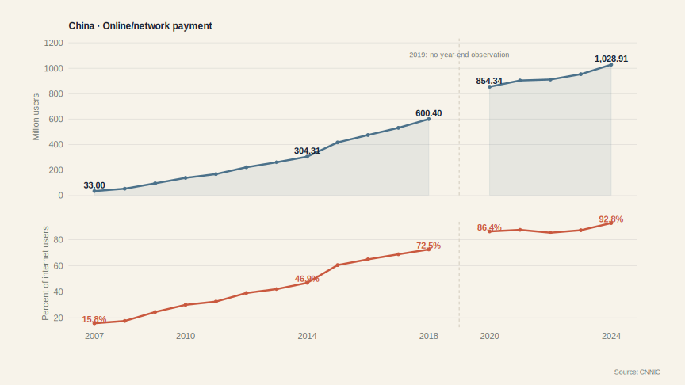

::: {.takeaway}
Online-payment adoption became broad; the inclusion gain is lower digital-access and merchant-acceptance friction, not universal access to credit.
:::

::: {.source}
Source: CNNIC statistical reports, year-end observations, 2007–2024; 2019 unavailable. The measure includes bank and third-party online payment and is not a causal estimate of third-party payment’s contribution.
:::
:::

## From Payment Records to Credit Information

Data ≠ automatic credit

::: {.mechanism}
::: {}
### Repeated transactions
Frequency, cash-flow timing, sales volatility and networks
:::
::: {}
### Cash-flow signals
More visibility into a small firm’s operating pattern
:::
::: {}
### Screening + pricing
Signals may complement identity, ownership, collateral and bureau data
:::
::: {}
### Loan decision + outcome
A lender still chooses exposure and bears default risk
:::
:::

::: {.takeaway}
Research supports information and mechanism effects, but payment records alone neither cause approval nor eliminate credit risk.
:::

::: {.source}
Source: BIS Working Papers No. 1011, *Big tech credit and monetary policy transmission* (2022), evidence for Chinese firms, 2017–2020.
:::

## What Third-Party Payment Changed—and What It Did Not Replace

Payment synthesis

::: {.comparison}
| Added or strengthened | Still anchored in banks and public infrastructure |
|---|---|
| wallet interface and authentication | deposits and settlement accounts |
| escrow and dispute rules | central-bank and interbank settlement |
| lower-cost merchant acceptance | liquidity provision and credit creation |
| network diffusion | prudential regulation and capital |
| transaction data and risk controls | ultimate loss bearing on bank loans |
:::

::: {.takeaway}
Payment institutions changed access, trust and information above the bank-based monetary system; they did not replace that system.
:::

## China’s Financial System: Formal, Market and Alternative Channels

Financial system 1 / 15

::: {.synthesis-map}
::: {}
### Formal intermediaries
Large banks, other banks, insurance and non-bank financial institutions
:::
::: {}
### Financial markets
Government and corporate bonds, public equity and market infrastructure
:::
::: {}
### Alternative finance
Relationship lending, trade credit, reputation and informal arrangements
:::
::: {}
### Foreign finance
Cross-border capital, institutions and market access
:::
:::

::: {.takeaway}
Allen and coauthors place Hybrid Sector firms across formal, market and alternative channels rather than equating China’s system with banks alone.
:::

::: {.source}
Sources: Allen, Qian & Qian (2005); Allen et al. (2012); Allen, Qian & Gu (2017).
:::

## A Bank Balance Sheet in One Picture

Where the risk sits

<h3>Assets · uses of funds</h3>

<strong>Reserves</strong>Settlement and liquidity

<strong>Securities</strong>Tradable claims

<strong>Loans</strong>Illiquid credit claims

<h3>Liabilities + equity · funding</h3>

<strong>Deposits</strong>Liquid customer claims

<strong>Other funding</strong>Wholesale and other liabilities

<strong>Equity</strong>First-loss absorber

::: {.takeaway}
Depositors hold liquid claims; the bank screens assets, manages liquidity and places loan losses against equity first.
:::

## What Banks Transform—and What Risks They Bear

Intermediation as transformation

::: {.transformation-grid}
::: {.transformation-card}
**Maturity transformation** → longer-duration productive lending → rollover and interest-rate risk
:::
::: {.transformation-card}
**Liquidity transformation** → withdrawable money backed by illiquid assets → liquidity risk
:::
::: {.transformation-card}
**Screening and monitoring** → informed loan allocation → model and governance risk
:::
::: {.transformation-card}
**Credit transformation** → pooled funding and loss absorption → credit and concentration risk
:::
:::

::: {.takeaway}
Banking creates value by transforming claims, but each transformation moves risk onto a regulated balance sheet.
:::

## Why Did China Develop Such a Large Banking System?

Institutional history

::: {.history-body}
::: {.timeline}
::: {.timeline-event}

<strong>Monobank legacy</strong>

The PBOC combined central- and commercial-banking roles.
:::
::: {.timeline-event}

<strong>Two-tier system</strong>

Specialized state banks separated major lending functions.
:::
::: {.timeline-event}

<strong>Big Four + policy banks</strong>

State-linked balance sheets financed investment and reform priorities.
:::
::: {.timeline-event}

<strong>Other banks + markets</strong>

Joint-stock, city and rural banks expanded as bond and equity markets developed gradually.
:::
:::

::: {.takeaway}
History explains the installed institutional capacity of banking; it does not imply today’s allocation is fixed or necessarily efficient.
:::

::: {.source}
Source: Allen et al. (2012) and Allen, Qian & Gu (2017), historical institutional accounts.
:::
:::

## Financial-Sector Assets over Time

China · 2018–2024 Q3

::: {.large-figure}
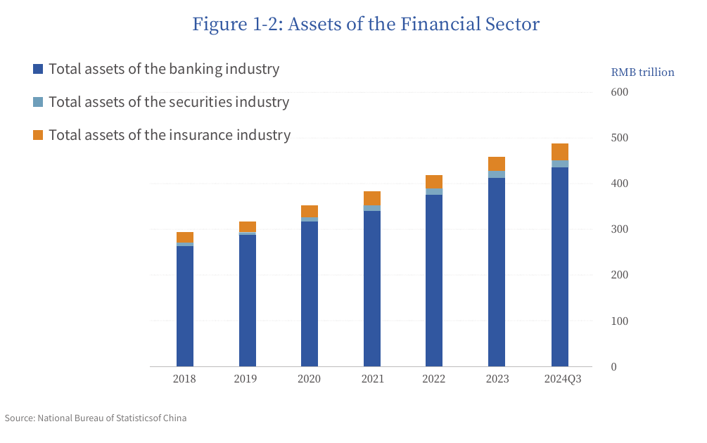

::: {.takeaway}
Banking assets remained the dominant balance-sheet stock across the 2018–2024 Q3 comparison; asset size describes scale, not allocation quality.
:::

::: {.source}
Source: NAFMII, *The Reform and Development of China’s Bond Market 2025*, Figure 1-2, using National Bureau of Statistics data.
:::
:::

## Household Saving Funds a Bank-Centered System

Deposits observed 2025-11

::: {.large-figure}
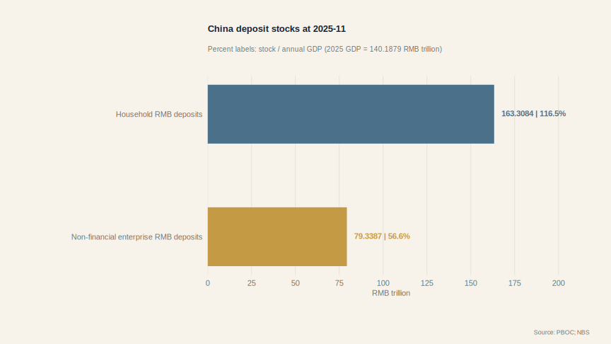

::: {.takeaway}
Household deposits alone exceeded one year of 2025 GDP, illustrating the funding scale behind bank-centered finance; this stock/GDP benchmark is not a savings rate.
:::

::: {.source}
Sources: People’s Bank of China, RMB deposit stocks, November 2025; National Bureau of Statistics, 2025 nominal GDP. Stocks are compared with annual GDP only as a scale benchmark.
:::
:::

## Beyond Bank Loans: AFRE / GDP by Financing Channel

China · 2002–2021

::: {.large-figure .expanded-chart}
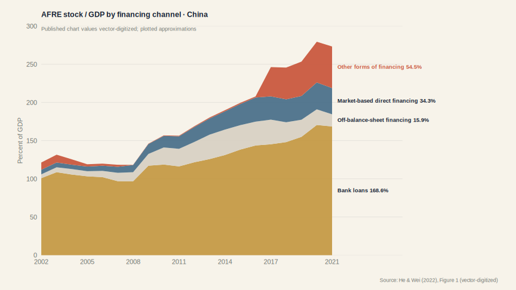

::: {.takeaway}
Bank lending remained the foundation, while nonbank channels drove the rise in AFRE after 2008.
:::

::: {.source}
Source: He & Wei (2022), Figure 1. Annual AFRE stock/GDP by channel, 2002–2021; vector-digitized plotted approximations.
:::
:::

## Private-Sector Credit / GDP: China, US, Euro Area and Japan

Four systems · 2000–2025

::: {.large-figure}
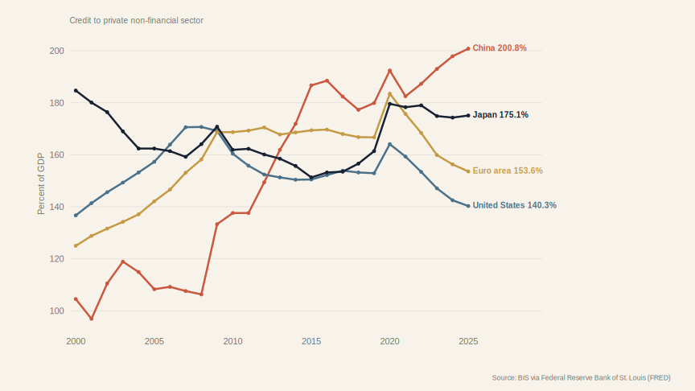

::: {.takeaway}
This system-wide depth measure covers private non-financial borrowers across lender sectors; unlike Slide 19, it does not classify credit by borrower ownership or Allen’s Hybrid Sector boundary.
:::

::: {.source}
Source: BIS credit to the private non-financial sector via FRED; annual year-end observations, 2000–2025.
:::
:::

## What Does AFRE/TSF Measure?

Define the boundary

::: {.mechanism}
::: {}
### Recipient
Funds obtained by the domestic real economy from the financial system
:::
::: {}
### Instruments
Loans, government and corporate bonds, equity and specified other channels
:::
::: {}
### Stock
Outstanding financing at a point in time
:::
::: {}
### Flow
New financing obtained during a period
:::
:::

::: {.takeaway}
AFRE/TSF is a recipient-side financing measure; it is neither total financial assets nor a synonym for corporate finance.
:::

::: {.source}
Source: People’s Bank of China, AFRE/TSF definition and 2025 year-end stock release.
:::

## How Large Is AFRE Relative to China’s Economy?

China · 2025 flow and year-end stock

::: {.large-figure}
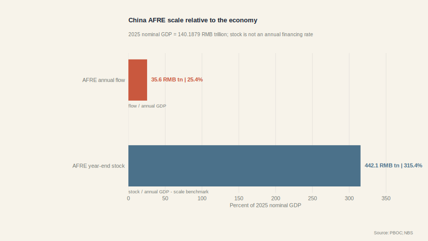

::: {.takeaway}
Annual AFRE flow/GDP measures new financing intensity, while year-end AFRE stock/annual GDP is only a scale benchmark—not an annual financing rate.
:::

::: {.source}
Sources: People’s Bank of China, 2025 AFRE flow and year-end stock; National Bureau of Statistics, 2025 nominal GDP. Flow/flow and stock/annual-flow benchmark are shown separately.
:::
:::

## What Is China’s Financing Mix Today?

China · end-2025

::: {.large-figure}
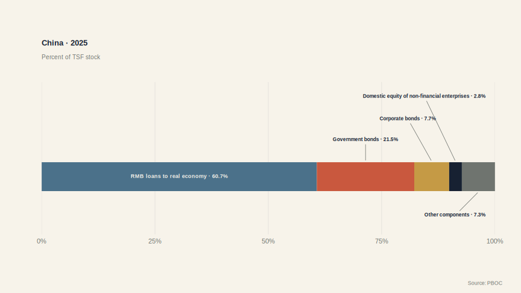

::: {.takeaway}
Loans remain the largest component of the end-2025 stock; government bonds are a major recipient-side category and should not be relabeled as firm direct finance.
:::

::: {.source}
Source: PBOC 2025 year-end AFRE/TSF stock release; the five displayed groups sum to 100%.
:::
:::

## Where Did China’s Leverage Accumulate?

China · 2000–2023

::: {.large-figure .expanded-chart}
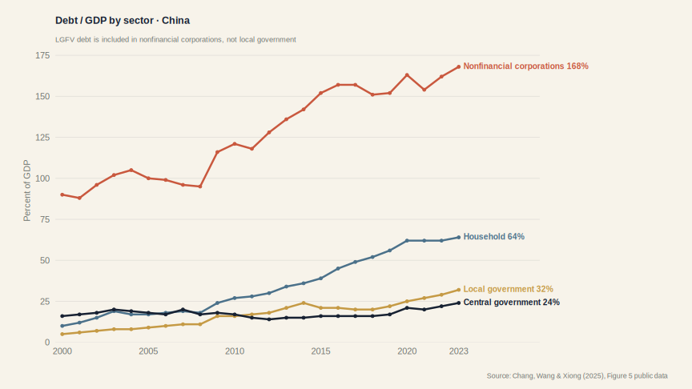

::: {.takeaway}
Most additional leverage accumulated in corporations and households; LGFV debt is counted in the corporate line here.
:::

::: {.source}
Source: Chang, Wang & Xiong (2025), Figure 5 and public workbook. LGFV debt is included in nonfinancial corporations.
:::
:::

## Why Official Local Debt Understates Fiscal Exposure

Broad local debt · 2015–2022

::: {.large-figure .expanded-chart}
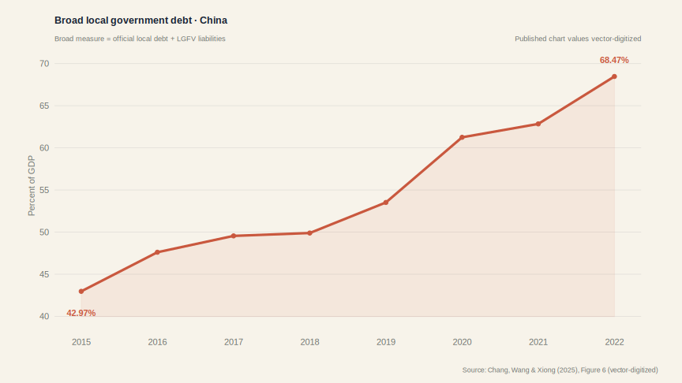

::: {.takeaway}
Adding LGFV liabilities to official local debt raises the measured exposure sharply—from about 43% to 68% of GDP in seven years.
:::

::: {.source}
Source: Chang, Wang & Xiong (2025), Figure 6. Broad local debt includes official debt and LGFV liabilities; vector-digitized plotted approximations.
:::
:::

## Stock-Market Capitalization / GDP: Three Available Systems

WDI comparison · through 2025

::: {.large-figure}
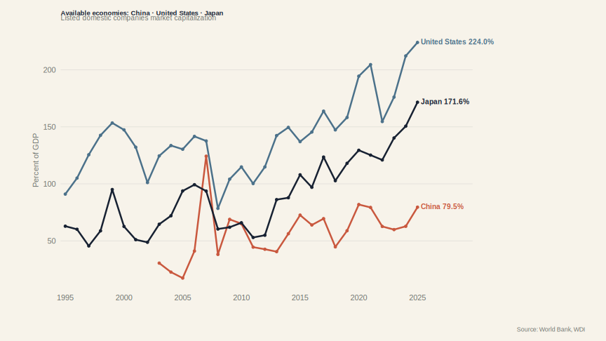

::: {.takeaway}
The WDI series compares China, the United States and Japan. The euro-area aggregate is excluded because no comparable WDI series is available on the same basis.
:::

::: {.source}
Source: World Bank WDI market capitalization/GDP, China, United States and Japan, through 2025.
:::
:::

## How Fast Did China’s Bond Market Grow?

China bond balances over time

::: {.large-figure}
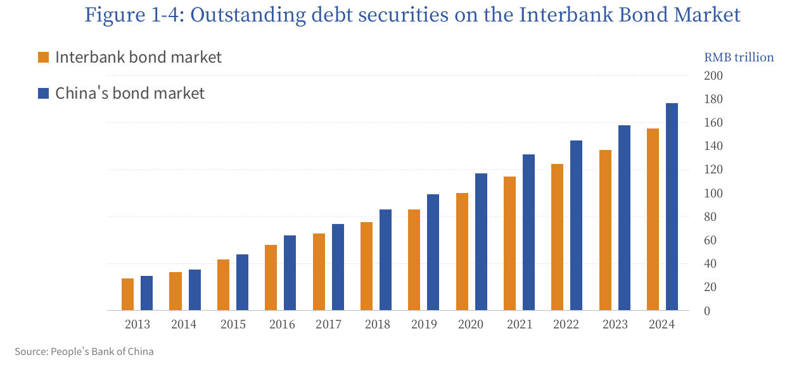

::: {.takeaway}
China’s outstanding bond balance rose substantially; comparing its scale across systems would require a common debt-securities definition and matching GDP denominators.
:::

::: {.source}
Source: NAFMII, *The Reform and Development of China’s Bond Market 2025*, Figure 1-4. Balances are stocks, not annual issuance.
:::
:::

::: {.thesis}
Lecture 2 asks what bond, equity and private-capital markets add to this bank-centered system.
:::
