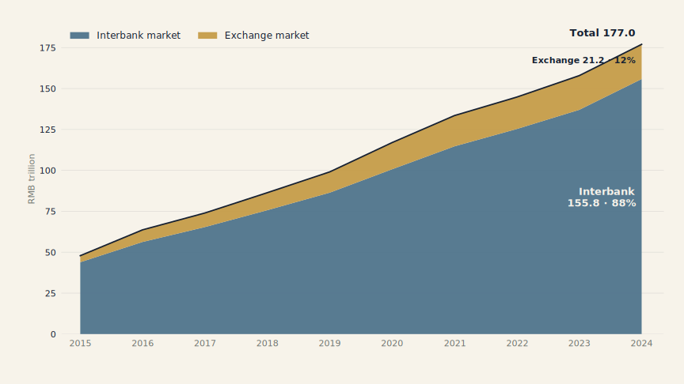
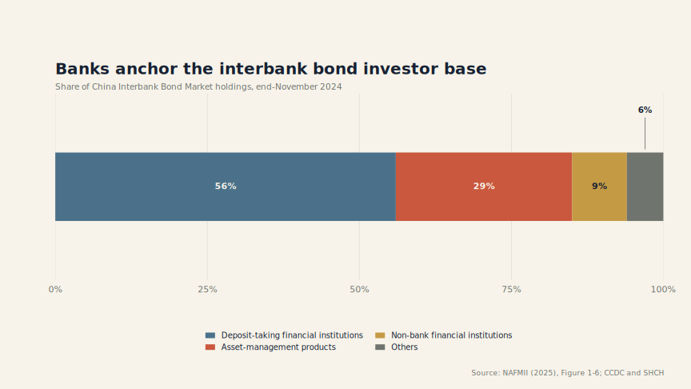
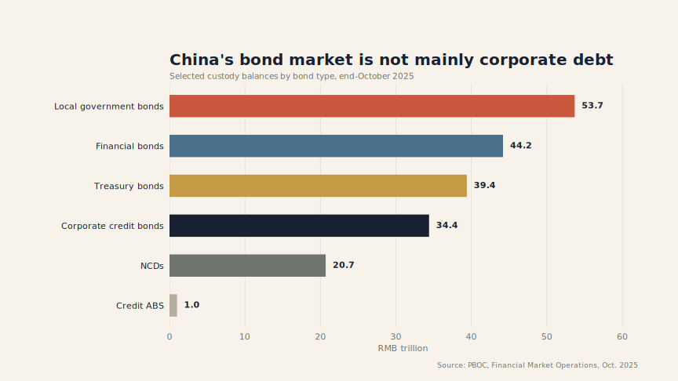
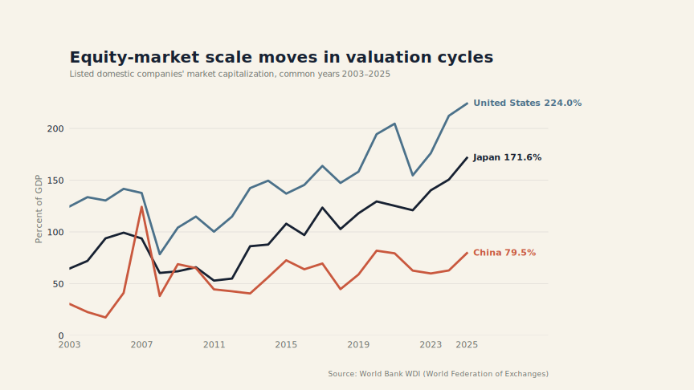
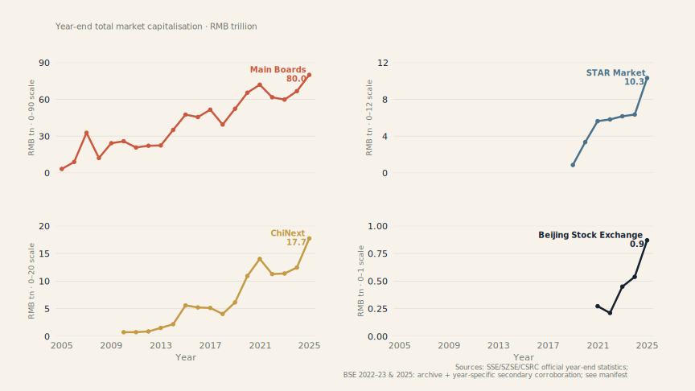
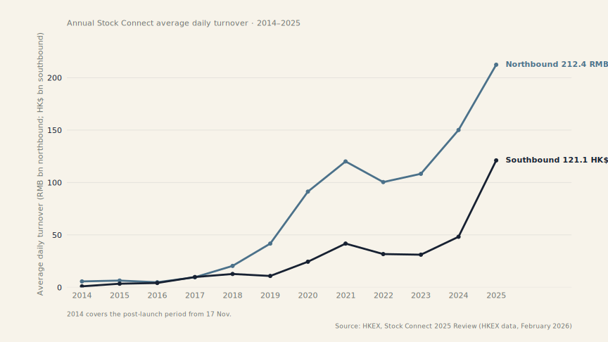
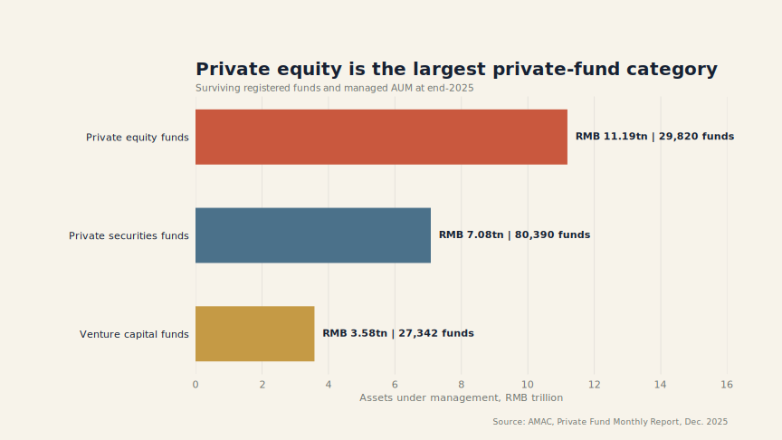
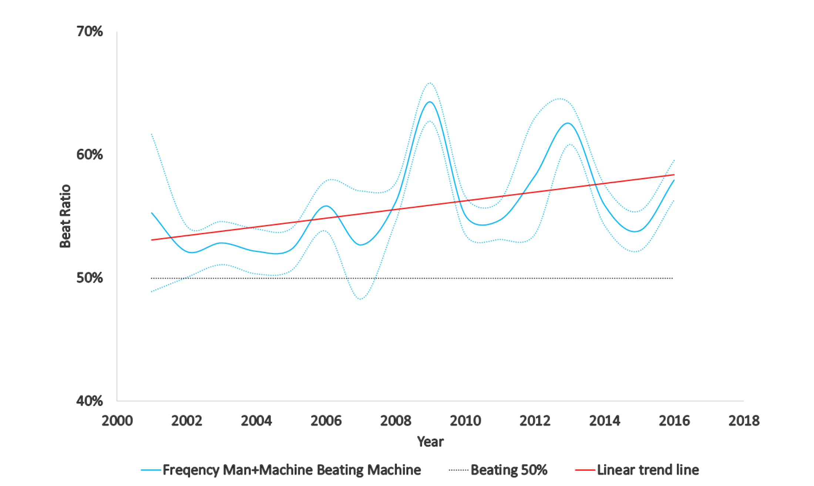
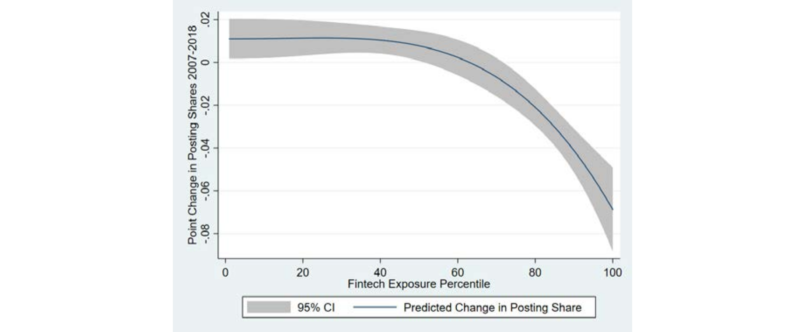

## Some Financing Problems Do Not Fit an Ordinary Bank Loan

:::::: {.question-marker}
Start with the financing problem
::::::

:::::: {.editorial-grid data-columns="3"}
::::: {}
### Predictable expansion
Cash flow is visible, assets are pledgeable, and failure risk is moderate.

**Likely fit:** loan or bond
:::::
::::: {}
### Volatile growth
Cash flow moves with the state of the world; upside is large and fixed repayment is fragile.

**Likely fit:** public equity
:::::
::::: {}
### Pre-revenue innovation
Assets are intangible, information is specialised, and learning takes time.

**Likely fit:** staged PE/VC
:::::
::::::

:::::: {.takeaway}
The financing problem—not a universal ranking of cost—determines the useful contract.
::::::

## Financial Contracts Are Contingent Claims

:::::: {.question-marker}
Start with states of the world, then map each state into payoffs
::::::

:::::: {.comparison}
| Realised firm cash flow | Debt payoff | Equity payoff | Who absorbs the marginal loss? |
|---:|---:|---:|---|
| **40 · bad state** | 40 | 0 | Creditor after equity is exhausted |
| **100 · base state** | 60 | 40 | Equity holder |
| **180 · good state** | 60 | 120 | Equity holder gains the upside |
::::::

:::::: {.thesis}
For promised debt repayment \(D=60\) and realised cash flow \(X\): debt receives \(\min(D,X)\); equity receives \(\max(X-D,0)\).
::::::

:::::: {.takeaway}
A financial contract is a state → payoff mapping, not merely a label such as “debt” or “equity.”
::::::

## Cash-Flow Rights and Control Rights Divide the States

:::::: {.question-marker}
The same states determine both payment and intervention
::::::

:::::: {.dual-flow}
::::: {}
### Performing state · (X > D)
**Cash flow →** creditor receives the promised amount; owner receives the residual.  
**Control →** managers and owners normally retain decision rights.
:::::
::::: {}
### Distress state · \(X < D\)
**Cash flow →** equity is wiped out before the senior claim is fully paid.  
**Control →** covenants, collateral enforcement or insolvency can shift decisions toward creditors.
:::::
::::::

:::::: {.takeaway}
Cash-flow rights allocate value across states; control rights specify who may act when the state deteriorates.
::::::

## Adverse Selection Can Drive Good Firms Out

:::::::: {.asym-diagram .asym-unravel data-contract="asym-diagram asym-unravel"}

::: {.asym-pool .asym-gutter-arrow-right data-node="pool"}
**Investor pool**

What investors see: **one pool**
:::

:::: {.asym-good-firm .asym-gutter-arrow-right data-node="good-firm"}
**Good firm = 120**

Hidden type
::::

::: {.asym-bad-firm .asym-gutter-arrow-right data-node="bad-firm"}
**Bad firm = 60**

Hidden type
:::

:::: {.asym-pooling-price .asym-gutter-arrow-right-double data-node="pooling-price"}
**Pooling price = ½ × 120 + ½ × 60 = 90**

Investors cannot observe type and price the average.
::::

::: {.asym-good-exit data-node="good-exit"}
**Good firm: undervalued → exits**
:::

:::: {.asym-bad-stay .asym-gutter-arrow-down .asym-arrow-brick data-node="bad-stay"}
**Bad firm: overpriced → stays**
::::

::: {.asym-remaining-pool data-node="remaining-pool"}
**Remaining pool**

Value **tends toward 60**; productive investment can disappear through **adverse selection**.
:::

:::: {.asym-unravel-loop data-node="unravel-loop"}
**Market unraveling ↺** Pool quality falls → investors cut price → more good firms withdraw
::::

::: {.asym-interrupt data-node="interrupt"}
**Break the loop — reveal type or absorb loss:** disclosure · screening · signalling · financial intermediation · collateral · net worth
:::
::::::::

:::::: {.source}
Sources: Mishkin, *The Economics of Money, Banking, and Financial Markets*, Ch. 8, pp. 171–177; Myers and Majluf (1984), “Corporate Financing and Investment Decisions When Firms Have Information That Investors Do Not Have.”
::::::

## Moral Hazard in Equity: The Principal-Agent Problem

:::::::: {.asym-diagram .asym-equity-wedge data-contract="asym-diagram asym-equity-wedge"}

::: {.asym-principal .asym-gutter-arrow-right data-node="principal"}
**Principal · outside investor**

Contributes **9,000** · owns **90%**
:::

:::: {.ownership-bar data-node="ownership-bar"}
Investor 90%Manager 10%
::::

::: {.asym-agent .asym-gutter-arrow-left .asym-gutter-arrow-down data-node="agent"}
**Agent · manager**

Contributes **1,000** · owns **10%**
:::

:::: {.asym-hidden-actions .asym-gutter-arrow-down .asym-arrow-brick data-node="hidden-actions"}
**Hidden action**

Effort · private benefits · cash reporting

Ownership and control are separated.
::::

::: {.asym-effort-cost data-node="effort-cost"}
**Manager bears 100% of effort cost**
:::

:::: {.asym-profit-share .asym-gutter-arrow-right .asym-arrow-brick data-node="profit-share"}
**Manager receives only 10% of incremental profit**
::::

::: {.asym-behaviour data-node="behaviour"}
**Private incentive → investor loss**

Shirk · consume private benefits · hide cash
:::

:::: {.asym-governance .asym-gutter-arrow-up .asym-arrow-gold data-node="governance"}
**Reconnect decisions and returns:** managerial ownership · monitoring · auditing · boards · VC control rights
::::
::::::::

:::::: {.source}
Source: Mishkin, *The Economics of Money, Banking, and Financial Markets*, Ch. 8, pp. 177–179.
::::::

## Moral Hazard in Debt: Borrowers May Shift Risk

:::::::: {.asym-diagram .asym-debt-fork data-contract="asym-diagram asym-debt-fork"}

::: {.asym-lender .asym-gutter-arrow-right data-node="lender"}
**Lender → 9,000 loan**

Finances a stable ice-cream store; creditor payoff is capped at principal plus interest.
:::

:::: {.asym-debt-controls .asym-gutter-arrow-down .asym-arrow-gold data-node="debt-controls"}
**Constrain the feasible action set before funds move:** borrower net worth · collateral · use-of-proceeds restrictions · covenants · monitoring
::::

::: {.asym-decision .asym-gutter-arrow-right-double data-node="decision"}
**Post-financing decision**

Hidden action after the debt price is fixed
:::

:::: {.safe-path .asym-gutter-arrow-right data-node="safe-path"}
**SAFE PATH ↑ Operate the store**

Predictable cash flow
::::

::: {.risk-path .asym-gutter-arrow-right .asym-arrow-brick data-node="risk-path"}
**RISK-SHIFTING PATH ↓ Redirect to research**

Low probability · high payoff · **asset substitution / risk shifting**
:::

:::: {.asym-success data-node="success"}
**SUCCESS**

Borrower captures most upside; lender receives principal plus interest.
::::

::: {.asym-failure data-node="failure"}
**FAILURE**

Lender bears much of the downside.
:::

:::: {.asym-risk-shifting data-node="risk-shifting"}
**Incentive incompatibility:** borrower prefers more risk than the lender.
::::
::::::::

:::::: {.source}
Source: Mishkin, *The Economics of Money, Banking, and Financial Markets*, Ch. 8, pp. 180–182.
::::::

## Cash Flow, Information and Control Determine Contract Choice

:::::: {.question-marker}
Theory becomes a selection rule
::::::

:::::: {.comparison}
| Contract | Best fit | Information mechanism | Control and downside |
|---|---|---|---|
| **Bank loan** | Predictable cash flow; collateral; relationship information | Private screening + monitoring | Covenants/collateral; bank capital bears credit loss |
| **Bond** | Scale; auditable issuer; limited need for intervention | Standard disclosure + ratings + market prices | Fixed claim; dispersed creditors bear default loss |
| **Public equity** | Volatile cash flow; high upside; broad disclosure possible | Continuous disclosure + public prices | Voting rights; shareholders bear residual loss |
| **PE/VC** | Intangible assets; severe uncertainty; learning over time | Specialised diligence + staged information | Boards/vetoes/milestones; investors and founders share residual risk |
::::::

:::::: {.takeaway}
As cash flow becomes less pledgeable and information becomes harder to verify, contracts rely more on residual claims and active control.
::::::

## China Implements These Contracts Through Distinct Markets

:::::: {.comparison}
| Market | Contract | Venue / institution | Issuer | Investor |
|---|---|---|---|---|
| **Bonds** | Fixed/senior claim; covenants | Interbank, exchanges, bank counters; PBOC/CSRC/NAFMII, custody and clearing systems | Governments, banks and firms | Banks, insurers, funds and other institutions |
| **Public equity** | Residual claim; voting rights | SSE, SZSE and BSE; CSRC, exchanges and CSDC | Listed firms across Main, STAR, ChiNext and BSE boards | Households, funds and other institutions |
| **PE/VC** | Negotiated residual claim; boards, vetoes and milestones | Private contracting; company/fund law and AMAC registration | Private and pre-IPO firms | LP-backed fund managers, strategic investors and founders |
::::::

:::::: {.takeaway}
China has several capital markets because different contracts need different disclosure, trading, custody, supervision and exit arrangements.
::::::

## Bonds Fit Predictable Cash Flow and Limited Control Needs

:::::: {.question-marker}
Why issue a bond rather than equity?
::::::

:::::: {.mechanism}
::::: {}
### At issuance
Investors transfer principal; the issuer promises interest, maturity and disclosure.
:::::
::::: {}
### Through time
The claim can trade, but investors do not normally manage the issuer day to day.
:::::
::::: {}
### In distress
Seniority, collateral and covenants shape recovery; default reallocates losses and sometimes control.
:::::
::::::

:::::: {.thesis}
Bond fit improves when cash flow is predictable, information is standardisable, financing needs are large and active investor control is unnecessary.
::::::

:::::: {.source}
Source: [NAFMII, *The Reform and Development of China’s Bond Market 2025*](https://www.nafmii.org.cn/englishnew/overseasparticipation/pandabond/resources/202504/P020250423396158840864.pdf).
::::::

## Two Core Venues Serve Different Instruments and Investors

:::::: {.comparison}
| Dimension | Interbank market | Exchange market |
|---|---|---|
| **Core users** | Banks, insurers, funds and other institutions | Securities firms, funds and eligible exchange investors |
| **Typical instruments** | Government and policy-bank bonds; financial bonds; interbank CDs; MTNs and commercial paper | Company bonds; convertible bonds; exchange ABS; government and local-government bonds |
| **Trading** | Institutional OTC: inquiry, market making and electronic execution through CFETS | Listed trading through securities accounts: order, click-to-deal and negotiated mechanisms |
| **Custody** | Primarily CCDC and SHCH | Primarily CSDC under the exchange account system |
| **Settlement** | Mainly trade-by-trade DVP through interbank infrastructure | Clearing and settlement through CSDC under exchange rules |
::::::

:::::: {.takeaway}
The two venues differ not only in access, but also in instruments, trading protocols and post-trade infrastructure.
::::::

:::::: {.source}
Sources: [NAFMII 2025, Figures 1-3 and 1-7](https://www.nafmii.org.cn/englishnew/overseasparticipation/pandabond/resources/202504/P020250423396158840864.pdf); [CSRC 2024 Annual Report](https://www.csrc.gov.cn/csrc/c100024/c7624098/7624098/files/%E4%B8%AD%E5%9B%BD%E8%AF%81%E5%88%B8%E7%9B%91%E7%9D%A3%E7%AE%A1%E7%90%86%E5%A7%94%E5%91%98%E4%BC%9A%E5%B9%B4%E6%8A%A5%EF%BC%882024%E5%B9%B4%EF%BC%89.pdf).
::::::

## China’s Bond Market Grew—But Remained Predominantly Interbank

:::::: {.evidence-layout}
::::: {.figure-height-md}

:::::
::::::

:::::: {.takeaway}
Total custody rose from **RMB 47.9tn in 2015** to **RMB 177.0tn in 2024**, while the interbank market still accounted for **88%** of the total.
::::::

:::::: {.source}
Sources: PBOC annual Financial Market Operations, 2015–2024; see [2017](https://www.gov.cn/xinwen/2018-01/26/5260831/files/d16527eb390c4e0a9d29c13b5f8b3edb.pdf), [2020](https://www.cnstock.com/image/202101/18/20210126174322387.pdf), [2021](https://cif.mofcom.gov.cn/cif/html/upload/20220211103346149_2021%E5%B9%B4%E9%87%91%E8%9E%8D%E5%B8%82%E5%9C%BA%E8%BF%90%E8%A1%8C%E6%83%85%E5%86%B5.pdf) and [2024](https://www.pbc.gov.cn/goutongjiaoliu/113456/113469/2025122616592613805/2025122616590775273.pdf). For 2015–2020, exchange equals total minus interbank; counter balances were not separately reported and were small.
::::::

## Institutions Anchor the Interbank Bond Market

:::::: {.evidence-layout}
::::: {.figure-height-lg}

:::::
::::::

:::::: {.takeaway}
Deposit-taking institutions held **56%** and asset-management products **29%** of interbank bonds at end-November 2024: this is primarily an institutional market.
::::::

:::::: {.source}
Source: [NAFMII 2025, Figure 1-6](https://www.nafmii.org.cn/englishnew/overseasparticipation/pandabond/resources/202504/P020250423396158840864.pdf); holdings recorded by CCDC and SHCH.
::::::

## A Large Bond Market Is Not Mainly Corporate Debt

:::::: {.evidence-layout}
::::: {.figure-height-lg}

:::::
::::::

:::::: {.takeaway}
Government and financial-institution debt dominate the end-October 2025 stock; “large bond market” does not mean corporate bonds dominate enterprise financing.
::::::

:::::: {.source}
Source: [PBOC, Financial Market Operations, October 2025](https://cif.mofcom.gov.cn/cif/html/upload/20251201140144995_2025%E5%B9%B410%E6%9C%88%E4%BB%BD%E9%87%91%E8%9E%8D%E5%B8%82%E5%9C%BA%E8%BF%90%E8%A1%8C%E6%83%85%E5%86%B5.pdf). Displayed categories omit small residual items.
::::::

## Reforms Expanded Access, Pricing and Default Discipline

:::::: {.question-marker}
Institutional constraint → reform response
::::::

:::::: {.timeline}
::::: {}
**1997**  
Institutional OTC market created → interbank venue becomes the core market.
:::::
::::: {}
**2007–08**  
NAFMII and registration-based issuance → broader debt-financing instruments and disclosure duties.
:::::
::::: {}
**2014 onward**  
Material defaults → credit differentiation becomes harder to ignore.
:::::
::::: {}
**2015 onward**  
Local-debt standardisation → local-government bonds become a major category.
:::::
::::: {}
**2020s**  
More unified disclosure, default and opening arrangements → greater cross-market consistency and foreign access.
:::::
::::::

:::::: {.takeaway}
Reform moved the market from administrative segmentation toward disclosure, pricing and loss recognition, while implicit-support expectations remain relevant.
::::::

:::::: {.source}
Sources: [NAFMII 2025](https://www.nafmii.org.cn/englishnew/overseasparticipation/pandabond/resources/202504/P020250423396158840864.pdf); [Geng and Pan, NBER Working Paper 26575](https://www.nber.org/system/files/working_papers/w26575/w26575.pdf).
::::::

## Bond Yields Mix Fundamentals with Liquidity and Support Expectations

:::::: {.question-marker}
A yield is a price, not a pure default probability
::::::

:::::: {.thesis}
Corporate yield = government benchmark + credit premium + liquidity premium − value of expected support
::::::

:::::: {.comparison}
| Same observable fundamentals | SOE issuer | Private issuer |
|---|---:|---:|
| Expected public support | Often higher | Often lower |
| Observed spread | Can be narrower | Can be wider |
| Interpretation | Fundamentals + liquidity + support | Fundamentals + liquidity + less support |
::::::

:::::: {.takeaway}
Defaults improve price discovery only when investors believe losses will actually be allocated through the contract.
::::::

:::::: {.source}
Source: [Geng and Pan, NBER Working Paper 26575](https://www.nber.org/system/files/working_papers/w26575/w26575.pdf). Teaching decomposition; no basis-point attribution is claimed.
::::::

## Equity Has a Primary and a Secondary Market

:::::: {.comparison}
| Dimension | Primary market | Secondary market |
|---|---|---|
| **What trades** | Newly issued shares | Existing listed shares |
| **Where cash goes** | Investors provide new equity capital to the firm | Cash normally moves between investors, not to the firm |
| **Financial institutions** | Investment banks / underwriters; accountants and lawyers; exchange and securities regulator | Exchanges; brokers; clearing and custody institutions; market makers where applicable |
| **Investors** | Institutions, strategic investors and eligible retail subscribers | Institutional and retail buyers and sellers |
| **Central function** | Capital raising, IPO pricing and allocation | Liquidity, ownership transfer and price discovery |
::::::

:::::: {.market-bridge}
**IPO is the primary-market sale; listing makes those shares tradable in the secondary market.**
::::::

:::::: {.takeaway}
The primary market finances the firm; the secondary market transfers ownership and produces observable market prices.
::::::

## China’s Equity Market Expanded in Waves

:::::: {.evidence-layout}
::::: {.figure-height-lg}

:::::
::::::

:::::: {.takeaway}
China’s listed-company market capitalisation rose from **30.5% of GDP in 2003** to **79.5% in 2025**, but the path reflects valuation cycles as well as market development.
::::::

:::::: {.source}
Source: [World Bank WDI, CM.MKT.LCAP.GD.ZS](https://databank.worldbank.org/metadataglossary/world-development-indicators/series/CM.MKT.LCAP.GD.ZS). End-year values; underlying source is the World Federation of Exchanges.
::::::

## China’s IPO System Moved from Approval to Registration

:::::: {.timeline}
::::: {}
**1993–2000 · Administrative allocation / approval**  
Quota management (1993–95) and indicator management (1996–2000) allocated issuance access through administrative recommendation.
:::::
::::: {}
**March 2001–2018 · Merit review and sponsor responsibility**  
CSRC approval replaced quotas; securities firms selected and recommended issuers, with sponsor accountability from 2004.
:::::
::::: {}
**2019–2022 · STAR and ChiNext registration pilots**  
Exchange inquiry and disclosure-centred review began on STAR, then expanded to ChiNext and BSE.
:::::
::::: {}
**2023 onward · Full registration across markets**  
Registration reached the Main Boards under exchange review and CSRC registration.
:::::
::::::

:::::: {.takeaway}
Disclosure and intermediary/exchange responsibility expanded, but listing remained regulated rather than automatic.
::::::

:::::: {.source}
Sources: [CSRC, *Stock Issuance and Listing*](https://www.csrc.gov.cn/csrc/c100211/c6288902/6288902/files/34fd93e40cde4184802c30a3c6714537.pdf) (quota management in 1993–95 and indicator management in 1996–2000); [CSRC, *Deepening Issuance-System Reform through the Sponsorship System*](https://www.csrc.gov.cn/csrc/c100028/c1002762/content.shtml) (2001 approval and 2004 sponsorship); [CSRC, *Consultation on Full Registration-System Rules*](https://www.csrc.gov.cn/csrc/c100028/c7047626/content.shtml) (STAR and ChiNext pilots); [CSRC, *Full Registration-System Rules Issued*](https://www.csrc.gov.cn/csrc/c100028/c7123213/content.shtml) (2023 full-market framework).
::::::

## New Equity Venues Serve Issuers the Main Boards Do Not Fit

:::::: {.comparison}
| Issuer problem | Venue / purpose |
|---|---|
| Younger growth firms have short histories and uncertain earnings. | **ChiNext** gives entrepreneurial and growth firms differentiated listing conditions. |
| R&D-intensive firms have intangible assets and technical risks. | **STAR** serves hard-technology issuers and piloted registration-based review. |
| Smaller innovative firms need a public route linked to the NEEQ pipeline. | **BSE** provides a venue focused on innovative SMEs. |
::::::

:::::: {.takeaway}
New venues segment issuers by information, technology and maturity rather than making one listing standard fit every firm.
::::::

:::::: {.source}
Sources: [SZSE, ChiNext](https://www.szse.cn/English/products/equity/ChiNext/); [SSE, STAR Market](https://english.sse.com.cn/markets/equities/star/); [BSE, exchange overview](https://www.bse.cn/company/introduce.html).
::::::

## Four Equity Submarkets Grew at Different Speeds

:::::: {.evidence-layout}
::::: {.figure-height-lg}

:::::
::::::

:::::: {.takeaway}
The Main Boards still dominate market capitalisation, while ChiNext, STAR and BSE show how newer venues expanded on very different scales and timelines.
::::::

:::::: {.source}
Sources: SSE/SZSE/CSRC official year-end statistics; BSE 2022–23 and 2025 combine the BSE archive with year-specific secondary corroboration (see manifest). Definition: year-end total market capitalisation, RMB trillion; panel-specific scales; missing years unfilled.
::::::

## Stock Connect Turned Market Opening into Trading Infrastructure

:::::: {.evidence-layout}
::::: {.figure-height-lg}

:::::
::::::

:::::: {.takeaway}
Opening worked through infrastructure: eligible securities, order routing, clearing, custody and quotas converted legal access into daily trading.
::::::

:::::: {.source}
Source: [HKEX, *Stock Connect 2025 Review*](https://www.hkexgroup.com/Media-Centre/Insight/Insight/2026/HKEX-Insight/Stock-Connect-2025-Review?sc_lang=en). Annual average daily turnover, 2014–2025; Northbound in RMB bn; Southbound in HKD bn; the two series are not currency-normalised. 2014 is the post-launch period from 17 November.
::::::

## Private Contracts Finance Information Before Public Prices Exist

:::::: {.question-marker}
Why PE/VC is more than “equity before IPO”
::::::

:::::: {.comparison}
| Dimension | PE/VC contract | Public equity |
|---|---|---|
| Information | Private, specialised diligence | Broad public disclosure |
| Financing | Staged rounds tied to milestones | Offering plus secondary trading |
| Control | Boards, vetoes, covenants and negotiated rights | Voting and securities-law protections |
| Pricing | Negotiated valuation | Continuous market price |
| Liquidity | Illiquid; exit must be arranged | Generally tradable after restrictions |
::::::

:::::: {.takeaway}
PE/VC finances the production of information: capital is released as technical, organisational and market evidence accumulates.
::::::

## China’s PE/VC System Connects Funds, Managers, Firms and Exits

:::::: {.question-marker}
The private market is an institutional chain
::::::

:::::: {.mechanism}
::::: {}
### Capital providers
Households and firms indirectly; institutions, insurers, corporates and government-guided capital as LPs
:::::
::::: {}
### Fund managers
Raise vehicles, screen projects, negotiate rights and monitor firms
:::::
::::: {}
### Portfolio firms
Receive staged capital, governance and strategic support
:::::
::::: {}
### Registration + rules
AMAC registration/filing within securities, fund and company-law arrangements
:::::
::::: {}
### Exit institutions
Trade sale, secondary transfer, repurchase or public listing
:::::
::::::

:::::: {.takeaway}
Policy capital is one participant in the chain; fund performance still depends on selection, governance, follow-on finance and credible exit.
::::::

:::::: {.source}
Sources: [AMAC private-fund statistics](https://www.amac.org.cn/sjtj/tjbg/smjj/); [State Council venture-capital measures, 2024](https://english.www.gov.cn/news/202406/22/content_WS6676227fc6d0868f4e8e8707.html).
::::::

## Private Funds Are Large but Category Boundaries Matter

:::::: {.evidence-layout}
::::: {.figure-height-lg}

:::::
::::::

:::::: {.takeaway}
At end-2025, registered private funds managed **RMB 22.15tn** across **138,315 funds**; AUM is a stock, not annual new investment or a measure of innovation finance.
::::::

:::::: {.source}
Source: [AMAC, Private Fund Registration and Filing Monthly Report, December 2025](https://www.amac.org.cn/sjtj/tjbg/smjj/202601/P020260126611919011850.pdf). Displayed categories omit small residual/special categories.
::::::

## Exit Institutions Shape Willingness to Fund Innovation

:::::: {.question-marker}
Early finance depends on a later route to liquidity
::::::

:::::: {.mechanism}
::::: {}
### Invest
Funds bear technical and market uncertainty
:::::
::::: {}
### Learn
Milestones turn private claims into evidence
:::::
::::: {}
### Disclose
Listing or acquisition broadens verification
:::::
::::: {}
### Exit
LP capital and manager incentives are realised
:::::
::::: {}
### Recycle
Returned capital can fund another cohort
:::::
::::::

:::::: {.thesis}
By July 2025, about **90% of 589 STAR companies** had pre-listing VC, with roughly **RMB 450bn** invested; the statistic describes the linkage, not a causal effect of listing on innovation.
::::::

:::::: {.source}
Source: [Shanghai Stock Exchange, July 2025](https://english.sse.com.cn/news/newsrelease/voice/c/c_20250723_10786279.shtml).
::::::

## AI Is Reorganising Information-Intensive Financial Work

:::::: {.comparison}
| Financial-work type | Task change | Retained responsibility |
|---|---|---|
| **Research / origination** | Extract, compare and draft analysis | Verify evidence; sign recommendations |
| **Customer service / advice** | Retrieve, explain and route cases | Own suitability, disclosure and escalation |
| **Risk / compliance** | Score risk; flag fraud and alerts | Set thresholds; review exceptions |
| **Operations / knowledge** | Reconcile, classify, code and search | Validate outputs, access and recovery |
| **Supervision / surveillance** | Detect links, abuse and anomalies | Investigate context; apply law |
::::::

:::::: {.takeaway}
AI changes the information-processing task; the institution retains judgment, control design, escalation and legal accountability.
::::::

:::::: {.source}
Source: [Signorini, “Artificial intelligence in finance,” BIS-hosted speech, July 2025](https://www.bis.org/review/r250728m.htm).
::::::

## AI Changes Tasks Before It Changes Accountable Institutions

:::::: {.comparison}
| Level | System role | Human role | Example |
|---|---|---|---|
| **Augment** | Retrieve, summarise, compare | Judge and sign | Review covenant changes |
| **Automate workflow** | Complete bounded steps | Control exceptions | Triage alerts |
| **Recommend** | Rank or score | Approve or escalate | Score credit risk |
| **Delegate action** | Execute within limits | Monitor and stop | Send restricted responses |
::::::

:::::: {.takeaway}
Moving from assistance to delegated action increases validation, monitoring, logging and escalation requirements; legal responsibility does not migrate to the model.
::::::

## Man + Machine Combines Different Information Advantages

:::::: {.large-figure .expanded-chart .paper-evidence-figure}
{fig-alt="Figure 3: year on the x-axis and annual beat ratio of AI-assisted analyst forecasts versus AI-only forecasts on the y-axis, with 95% confidence bounds and a 50% reference line"}

:::::: {.takeaway}
In this task, analyst information adds forecast value relative to the AI-only model, showing a specific complementarity rather than a general ranking of humans and AI.
::::::

:::::: {.source}
Source: [Cao et al., NBER Working Paper 28800](https://www.nber.org/papers/w28800.pdf), Figure 3 (PDF p. 35). U.S. I/B/E/S, out-of-sample **2001–2016**; year-end target-price forecast task, not current AI or other financial tasks.
::::::
::::::

## AI Wins on Scale; Humans Add Soft Information

:::::: {.task-definition}
**Forecasting task:** Predict each covered firm’s **year-end stock price** using information available when the forecast is made; performance is lower absolute error relative to the realised year-end price.
::::::

:::::: {.comparison}
| Forecast comparison | Main finding | Where the advantage is strongest |
|---|---|---|
| **AI forecast vs. concurrent human forecast** | AI has lower error than **53.7%** of analyst forecasts | More complex firms; high-dimensional, transparent and voluminous public information |
| **Human forecast vs. concurrent AI forecast** | Human forecasts remain competitive | Smaller and illiquid firms; intangible assets; distressed industries requiring institutional knowledge |
| **AI augmented with analyst forecast vs. AI-only** | Combined model beats **57.3%** of analyst forecasts and outperforms AI-only in **all years** | Long horizons, difficult industries and settings where soft information complements computation |
::::::

:::::: {.takeaway}
The paper’s mechanism is comparative advantage: machines scale public-information processing; analysts contribute institutional knowledge and soft information.
::::::

:::::: {.source}
Source: [Cao et al., NBER Working Paper 28800](https://www.nber.org/system/files/working_papers/w28800/w28800.pdf), pp. 3–6. U.S. analyst target-price forecasts, 2001–2016.
::::::

## Fintech Disruption Reallocates Jobs and Skills

:::::: {.large-figure .expanded-chart .paper-evidence-figure}
{fig-alt="Figure 6: fintech exposure percentile on the x-axis and 2007–2018 cumulative change in posting share on the y-axis, with a predicted curve and 95% confidence interval"}

:::::: {.takeaway}
Higher occupation-level fintech exposure is associated with a larger **2007–2018 vacancy-share decline**; this is not causal evidence of layoffs, employment loss or firm/economic growth.
::::::

:::::: {.source}
Source: [Jiang et al., NBER Working Paper 28668](https://www.nber.org/papers/w28668), Figure 6 (PDF p. 43). U.S. occupation-level patent/task-text exposure and vacancy postings; exposure is not observed adoption, and vacancy flows are not employment stocks.
::::::
::::::

## Fintech Changes Hiring Before It Changes Firm Performance

:::::: {.comparison}
| Margin | Main finding | Interpretation |
|---|---|---|
| **Job demand** | Top-quartile exposed occupations lose about **5%** of posting share from 2007 to 2018 | Disruption is strongest for middle-pay and middle-education occupations |
| **Skill demand** | Employers request more education, experience and **finance + software** skills | Upskilling replaces finance-only hiring rather than simply eliminating every exposed role |
| **Firm adaptation** | Exposed firms have lower employment growth but no comparable deterioration in sales, **ROA** or R&D | Original fintech **inventor** firms hire and invest more; patent acquirers do not show the same gains |
::::::

:::::: {.takeaway}
Fintech reallocates tasks and required skills; the firms that create the technology adapt better than firms that only acquire it.
::::::

:::::: {.source}
Source: [Jiang et al., NBER Working Paper 28668](https://www.nber.org/system/files/working_papers/w28668/w28668.pdf), pp. 2–5. U.S. patents and vacancy postings, 2007 and 2010–2018; exposure is not observed adoption.
::::::

## AI Adoption Creates a New Governance Stack

:::::: {.question-marker}
Capability is useful only when the institution can control it
::::::

:::::: {.mechanism}
::::: {}
### Data
Provenance, consent, quality, representativeness, privacy and security
:::::
::::: {}
### Model
Fit-for-purpose testing, robustness, bias, hallucination and change control
:::::
::::: {}
### Workflow
Access rights, evidence retention, logging and human escalation
:::::
::::: {}
### Third parties
Cloud/model concentration, contracts, resilience and exit plans
:::::
::::: {}
### Institution
Named owner, risk appetite, independent validation, audit and supervisory accountability
:::::
::::::

:::::: {.takeaway}
The newest supervisory focus is not only model accuracy: it is whether data and third-party dependencies remain governable as AI enters core financial processes.
::::::

:::::: {.source}
Source: [BIS Financial Stability Institute, *In data we trust?*, March 2026](https://www.bis.org/fsi/publ/insights73.htm).
::::::

## Going Forward: Finance in 5–10 Years?

:::::: {.question-marker}
Discuss how finance may change across five dimensions—and what evidence would change your mind
::::::

:::::: {.comparison}
| Prediction target | Your 5–10 year forecast | Observable test |
|---|---|---|
| **claim standardisation** | Which financing claims become easier to compare, issue or trade? | Issuance mix, spreads, turnover or disclosure comparability |
| **private information** | Where does proprietary, local or relationship information remain valuable? | Pricing errors, analyst value or contract intensity by opacity |
| **job / skill reallocation** | Which tasks shrink, which hybrid skills grow and who moves between them? | Postings, employment stocks, wages and internal transfers |
| **automation boundary** | Which decisions stay assisted, become bounded automation or remain human-only? | Delegation limits, exception rates, overrides and losses |
| **accountability** | Who signs, monitors, stops and compensates when an automated process fails? | Named owners, audit trails, enforcement and redress outcomes |
::::::

:::::: {.takeaway}
For discussion: **By 2031–36, X may change because Y; what evidence would make this prediction more or less convincing?**
::::::
